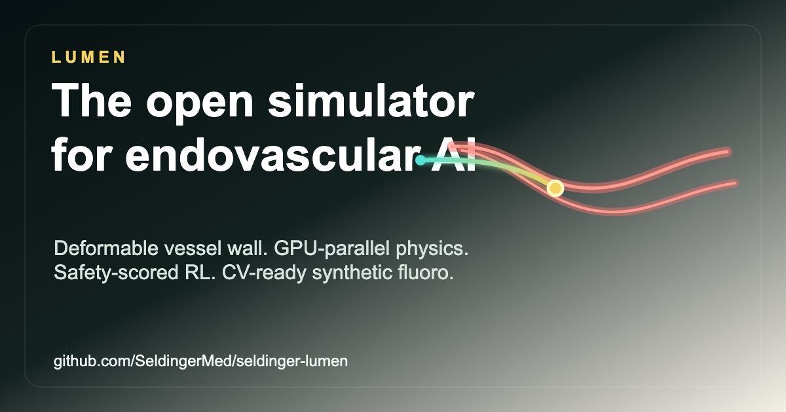
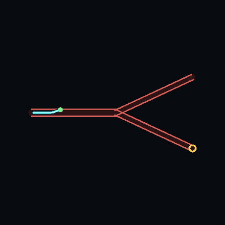
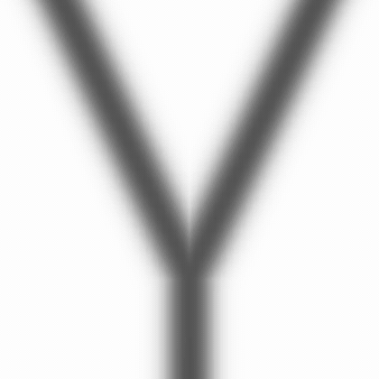

# Lumen

**Open, differentiable, GPU-parallel simulation for endovascular AI.**

Lumen is an Apache-2.0 research environment for training and evaluating agents that
navigate slender devices through deformable vascular anatomy. It combines a
Newton/Warp physics backend, tube-intrinsic contact, an anisotropic deformable wall,
synthetic fluoroscopy, CV labels, Gymnasium environments, and a safety-scored RL
benchmark in one public stack.

**Launch page, demo video, and preprint:**
https://seldingermed.github.io/seldinger-lumen/



## Why It Exists

Most open catheter RL environments make target-reaching easy to score and wall safety
hard to see. Lumen treats the clinically relevant pieces as first-class:

- deformable HGO-style vessel wall, not a rigid pipe;
- implicit tube-intrinsic contact on NVIDIA Newton/Warp;
- torsion, anisotropic friction, flow, and clot interaction hooks;
- synthetic fluoroscopy with masks, keypoints, node positions, and labels;
- replayable case bundles and dataloader indexes;
- benchmark rankings that prefer safe success over raw success.

## Install

```bash
git clone https://github.com/SeldingerMed/seldinger-lumen
cd seldinger-lumen
pip install -e ".[dev]"
lumen doctor
```

## First Run

```bash
lumen play stenotic --out lumen-run
lumen benchmark lumen-bench
lumen render-fluoro lumen-fluoro.png
lumen capture lumen-episodes
lumen validate lumen-episodes --require-cv-labels
lumen index lumen-episodes --out lumen-episodes/index.jsonl --check-sidecars
lumen split-index lumen-episodes/index.jsonl --out-dir lumen-episodes/splits
```

The package also registers Gymnasium environments:

```python
import gymnasium as gym
import lumen.envs.registration

env = gym.make("Lumen/NavStenotic-v0")
obs, info = env.reset()
obs, reward, terminated, truncated, info = env.step(env.action_space.sample())
```

## Demo

<p align="center">
  
  
</p>

The left view is the control/debug view. The right view is the synthetic fluoroscopy
stream used by image-observation policies and CV data tooling.

## Citation

If Lumen is useful in your work, cite the launch preprint:

```bibtex
@software{son_lumen_2026,
  author = {Son, Colin},
  title = {Lumen: an Open, Differentiable, GPU-Parallel Environment for Endovascular AI},
  year = {2026},
  url = {https://github.com/SeldingerMed/seldinger-lumen},
  license = {Apache-2.0}
}
```

## License

Apache-2.0.
