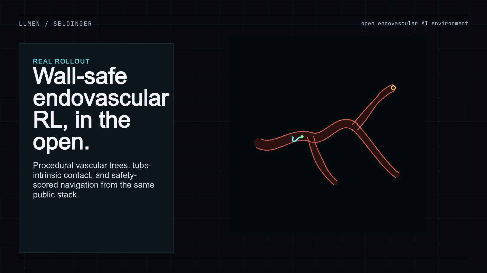

  <section class="lumen-hero">
    

      
Open endovascular AI environment

      <h1>Wall-safe vascular navigation, in the open.</h1>
      

        Lumen is an Apache-2.0 simulator for training and evaluating endovascular AI agents across deformable vascular anatomy, tube-intrinsic contact, synthetic fluoroscopy, luminal RGB, CV labels, and safety-scored Gymnasium benchmarks.
      

      

        <a class="lumen-button primary" href="https://github.com/SeldingerMed/seldinger-lumen">GitHub</a>
        <a class="lumen-button" href="assets/launch/lumen-preprint.pdf">Preprint PDF</a>
        <a class="lumen-button" href="assets/launch/lumen-launch.mp4">Launch video</a>
      

    

    

      
    

  </section>

  <section class="section">
    

      <video controls playsinline poster="assets/launch/social-card.png">
        <source src="assets/launch/lumen-launch.mp4" type="video/mp4">
      </video>
    

  </section>

  <section class="section">
    <h2>What Lumen Solves</h2>
    

      
<strong>Wall safety is scored</strong> Target reach is separated from safe target reach, so unsafe wall interaction does not look like a clean success.

      
<strong>The lumen is state</strong> Contact, route progress, wall penetration, torsion, and friction hooks are emitted from the same simulation stack.

      
<strong>Images are first-class</strong> Fluoroscopy, masks, keypoints, labels, detector noise, and luminal RGB are generated from one scene.

      
<strong>Advanced use cases ship</strong> Flow diversion, aneurysm inflow traces, clot fields, retrieval, and fragmentation are exposed as simulator state.

      
<strong>Benchmarks are reproducible</strong> Cases, captures, episode sidecars, indexes, and splits are designed for reruns and comparison.

      
<strong>The stack is public</strong> The repository, launch video, screenshots, and preprint are available from this page.

    

  </section>

  <section class="section">
    <h2>Real Simulator Captures</h2>
    

      

      

      

      

    

  </section>

  <section class="section">
    <h2>Why It Moves Beyond CathSim</h2>
    

      CathSim made open endovascular RL research easier to start. Lumen is aimed at the next benchmark layer: deformable-wall semantics, wall-safety scoring, paired image/state observations, dataset-grade labels, and endovascular modules that expose flow, aneurysm, clot, and device effects. The result is a stronger public substrate for agents that must optimize more than reaching a coordinate.
    

  </section>

  <section class="section">
    <h2>Run It</h2>
    <pre class="code-block"><code>git clone https://github.com/SeldingerMed/seldinger-lumen
cd seldinger-lumen
pip install -e ".[dev]"
lumen doctor
lumen play stenotic --out lumen-run
lumen benchmark lumen-bench
lumen capture lumen-episodes
lumen validate lumen-episodes --require-cv-labels</code></pre>
  </section>

  <section class="section">
    <h2>Research Package</h2>
    <ul>
      <li><a href="assets/launch/lumen-preprint.pdf">Read the launch preprint PDF</a></li>
      <li><a href="assets/launch/lumen-preprint-latex.zip">Download the LaTeX source ZIP</a></li>
      <li><a href="assets/launch/social-media-proposals.md">Open the launch post drafts</a></li>
      <li><a href="https://github.com/SeldingerMed/seldinger-lumen">Open the public repository</a></li>
    </ul>
  </section>

