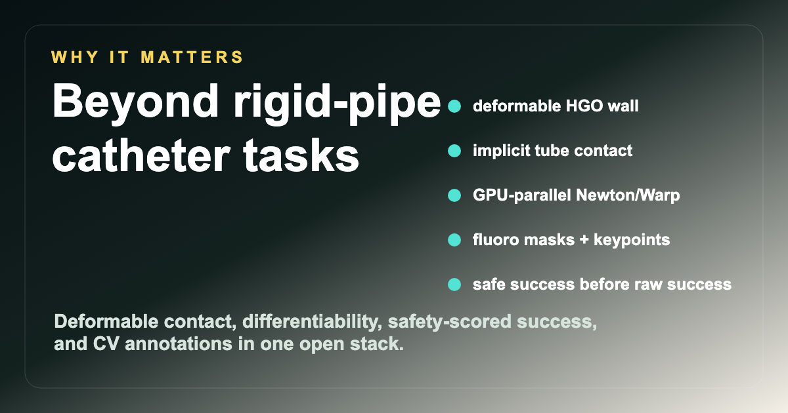

<style>
  .lumen-hero {
    margin: 0 0 2.2rem;
    padding: 2.2rem 0 1rem;
  }
  .lumen-eyebrow {
    color: #d6ae32;
    font-weight: 800;
    letter-spacing: .16em;
    text-transform: uppercase;
    margin-bottom: .6rem;
  }
  .lumen-hero h1 {
    font-size: clamp(2.4rem, 7vw, 5.2rem);
    line-height: .96;
    letter-spacing: 0;
    margin: 0 0 1rem;
  }
  .lumen-lede {
    max-width: 880px;
    font-size: 1.2rem;
    line-height: 1.55;
    color: #41504a;
  }
  .lumen-actions {
    display: flex;
    gap: .75rem;
    flex-wrap: wrap;
    margin: 1.3rem 0 1.8rem;
  }
  .lumen-button {
    display: inline-block;
    border-radius: 7px;
    padding: .78rem 1rem;
    font-weight: 750;
    border: 1px solid #1f6f66;
  }
  .lumen-button.primary {
    background: #0f766e;
    color: white;
  }
  .lumen-button.secondary {
    color: #0f5f58;
    background: white;
  }
  .media-frame {
    overflow: hidden;
    border-radius: 8px;
    border: 1px solid #d8e0dc;
    background: #06100f;
  }
  .media-frame video,
  .media-frame img {
    display: block;
    width: 100%;
    height: auto;
  }
  .grid-2 {
    display: grid;
    grid-template-columns: repeat(2, minmax(0, 1fr));
    gap: 1rem;
    align-items: start;
  }
  .grid-3 {
    display: grid;
    grid-template-columns: repeat(3, minmax(0, 1fr));
    gap: 1rem;
  }
  .callout {
    border-left: 4px solid #0f766e;
    padding: .75rem 1rem;
    background: #f5faf8;
    margin: 1rem 0;
  }
  .metric {
    padding: 1rem;
    border: 1px solid #d8e0dc;
    border-radius: 8px;
    background: #ffffff;
  }
  .metric strong {
    display: block;
    color: #073b37;
    font-size: 1.05rem;
    margin-bottom: .25rem;
  }
  @media (max-width: 720px) {
    .grid-2,
    .grid-3 {
      grid-template-columns: 1fr;
    }
  }
</style>

<section class="lumen-hero">
  <div class="lumen-eyebrow">Open endovascular AI simulator</div>
  <h1>Lumen makes wall-safe vascular navigation trainable.</h1>
  <p class="lumen-lede">
    Lumen is an Apache-2.0, differentiable, GPU-parallel simulator for AI agents
    navigating slender devices through deformable vascular anatomy. It pairs
    Newton/Warp physics with synthetic fluoroscopy, CV labels, replayable datasets,
    Gymnasium environments, and benchmark scoring that ranks safe success before raw
    target reach.
  </p>
  <div class="lumen-actions">
    <a class="lumen-button primary" href="https://github.com/SeldingerMed/seldinger-lumen">GitHub</a>
    <a class="lumen-button secondary" href="assets/launch/lumen-preprint.pdf">Preprint PDF</a>
    <a class="lumen-button secondary" href="assets/launch/lumen-launch.mp4">Launch video</a>
  </div>
</section>

<div class="media-frame">
  <video controls playsinline poster="assets/launch/social-card.png">
    <source src="assets/launch/lumen-launch.mp4" type="video/mp4">
  </video>
</div>

## What Lumen Is

Lumen is a research environment for endovascular reinforcement learning and computer
vision. The central object is a deformable lumen: a branching, procedurally generated
vascular path with contact, wall state, friction, torsion, flow, clot interaction
hooks, and image formation.

The core loop is simple:

```bash
pip install -e ".[dev]"
lumen doctor
lumen play stenotic --out lumen-run
lumen benchmark lumen-bench
lumen capture lumen-episodes
lumen validate lumen-episodes --require-cv-labels
```

## What It Solves

Existing open endovascular RL simulators made autonomous catheterization practical to
study. Lumen pushes the open surface toward the harder problem researchers actually
need to optimize:

<div class="grid-3">
  <div class="metric"><strong>Deformable wall</strong> The lumen is a physical field, not just a rigid visual pipe.</div>
  <div class="metric"><strong>Implicit contact</strong> Tube-intrinsic contact is injected into the Newton/Warp solve.</div>
  <div class="metric"><strong>Safety-first score</strong> Safe success ranks above raw target reach.</div>
  <div class="metric"><strong>CV labels</strong> Synthetic fluoro ships with masks, keypoints, and node positions.</div>
  <div class="metric"><strong>Dataset workflow</strong> Capture, validate, index, split, and materialize replayable episodes.</div>
  <div class="metric"><strong>Open license</strong> Apache-2.0 core for research and commercial experimentation.</div>
</div>

## Same Rollout, Two Views

<div class="grid-2">
  <div>
    <div class="media-frame">
      
    </div>
    <p><strong>Schematic control view.</strong> Useful for debugging policy behavior and
    wall-safety outcomes.</p>
  </div>
  <div>
    <div class="media-frame">
      
    </div>
    <p><strong>Synthetic fluoroscopy.</strong> The image stream used by CV pipelines and
    image-observation policies.</p>
  </div>
</div>

## Why It Is Better Than Rigid-Pipe Catheter Tasks

Rigid catheter tasks can reward target reach while hiding the thing that matters:
unsafe wall interaction. Lumen makes safety observable and scoreable. A policy that
reaches the target after breaching the wall is reported as unsafe success, not a clean
win.

<div class="media-frame">
  
</div>

The result is a stronger benchmark substrate for learning:

- deformable HGO-style vessel wall;
- tube-intrinsic contact rather than detached collision geometry;
- differentiable Newton/Warp simulation path;
- paired state and image observations;
- synthetic masks/keypoints for CV training;
- deterministic replayable case bundles;
- episode-grouped train/validation/test splits.

## Research Package

The launch preprint describes the design, benchmark semantics, and relationship to
CathSim and related autonomous endovascular navigation work.

- [Read the preprint PDF](assets/launch/lumen-preprint.pdf)
- [Download LaTeX source ZIP](assets/launch/lumen-preprint-latex.zip)
- [Open the repository](https://github.com/SeldingerMed/seldinger-lumen)

## Quick Citation

```bibtex
@software{son_lumen_2026,
  author = {Son, Colin},
  title = {Lumen: an Open, Differentiable, GPU-Parallel Environment for Endovascular AI},
  year = {2026},
  url = {https://github.com/SeldingerMed/seldinger-lumen},
  license = {Apache-2.0}
}
```

Apache-2.0.
