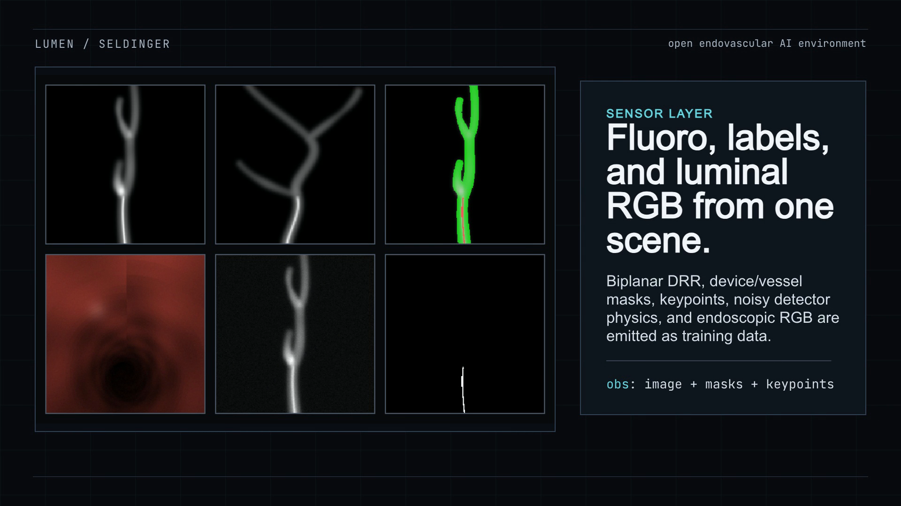
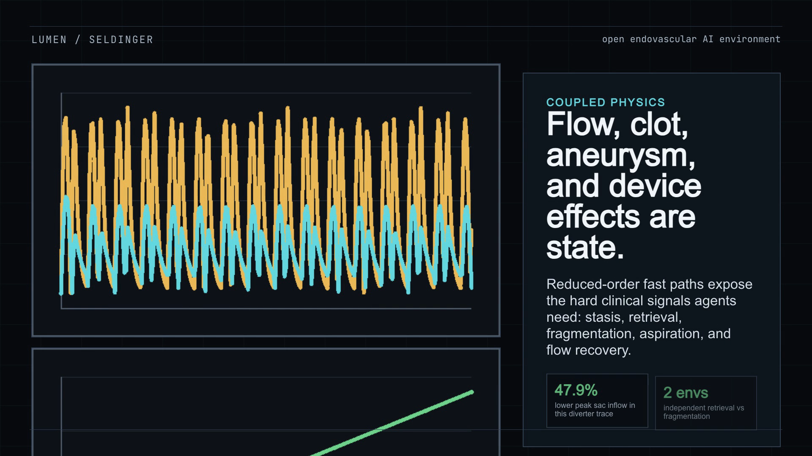
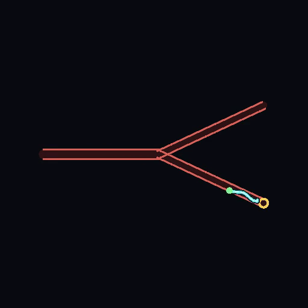
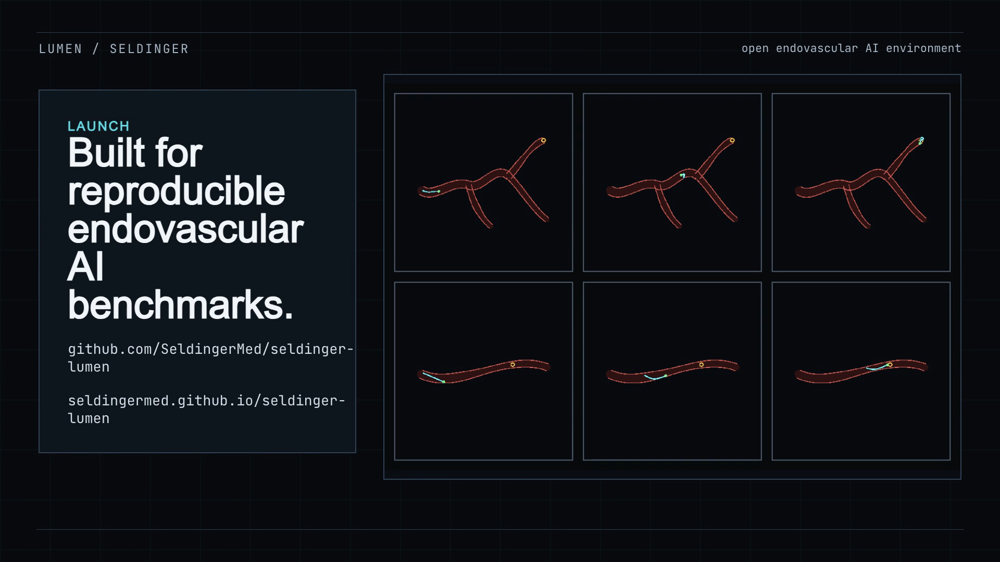

  <section class="lumen-hero">
    

      
Lumen

      <h1>An open simulator for endovascular navigation research.</h1>
      

        Lumen is an Apache-2.0 environment for catheter and guidewire navigation. It includes procedural vascular cases, safety-scored rollouts, synthetic fluoroscopy, luminal RGB, masks, keypoints, replay metadata, and Gymnasium tasks.
      

      

        <a class="lumen-button primary" href="https://github.com/SeldingerMed/seldinger-lumen">GitHub</a>
        <a class="lumen-button" href="assets/launch/lumen-preprint.pdf">Preprint PDF</a>
      

    

    

      <video
        src="assets/launch/lumen-launch.mp4"
        poster="assets/launch/physics-layer.png"
        controls
        muted
        playsinline
      ></video>
    

  </section>

  <section class="section">
    <h2>What Is Included</h2>
    

      
<strong>Safe target reach</strong> A run can reach the target and still be marked unsafe if wall or force limits are exceeded.

      
<strong>Device route state</strong> Route progress, contact, penetration, torsion, and friction hooks are recorded during navigation.

      
<strong>Image outputs</strong> Fluoroscopy, masks, keypoints, detector noise, and luminal RGB come from the same case state.

      
<strong>Procedure modules</strong> Flow diversion, aneurysm inflow, clot fields, retrieval, and fragmentation are exposed as state.

      
<strong>Replayable cases</strong> Episode sidecars, captures, indexes, and splits are built for reruns and outside inspection.

      
<strong>Release files</strong> Code, benchmark summaries, preprint, screenshots, and launch materials are collected here.

    

  </section>

  <section class="section">
    <h2>Benchmark Result</h2>
    

      In a matched branch-navigation PPO run, both environments trained for 50,000 steps and were evaluated for 30 deterministic held-out episodes. Lumen reached 100% raw success and 100% safe success on <code>nav_tree_branch</code>. CathSim reached 100% raw success on <code>phantom3_bca</code>, but 6.7% safe success under the comparison force threshold.
    

    

      
<strong>100%</strong> Lumen safe success across 30 PPO eval episodes.

      
<strong>6.7%</strong> CathSim safe success under the matched force threshold.

      
<strong>79.7 vs 12.1</strong> Eval steps/s for Lumen vs CathSim in the matched run.

    

  </section>

  <section class="section">
    <h2>Real Simulator Captures</h2>
    

      

      

      

      

    

  </section>

  <section class="section">
    <h2>Run It</h2>
    <pre class="code-block"><code>git clone https://github.com/SeldingerMed/seldinger-lumen
cd seldinger-lumen
pip install -e ".[dev]"
lumen doctor
lumen play stenotic --out lumen-run
lumen benchmark lumen-bench
lumen capture lumen-episodes
lumen validate lumen-episodes --require-cv-labels</code></pre>
  </section>

  <section class="section">
    <h2>Research Package</h2>
    <ul>
      <li><a href="assets/launch/lumen-preprint.pdf">Read the launch preprint PDF</a></li>
      <li><a href="assets/launch/lumen-preprint-latex.zip">Download the LaTeX source ZIP</a></li>
      <li><a href="assets/launch/benchmark/ppo-short-50k-lumen-cathsim-summary.csv">Download the matched PPO benchmark CSV</a></li>
      <li><a href="assets/launch/benchmark/pilot-summary-lumen-cathsim-steve.csv">Download the Lumen/CathSim/stEVE pilot CSV</a></li>
      <li><a href="assets/launch/social-media-proposals.md">Open the launch post drafts</a></li>
      <li><a href="https://github.com/SeldingerMed/seldinger-lumen">Open the public repository</a></li>
    </ul>
  </section>

