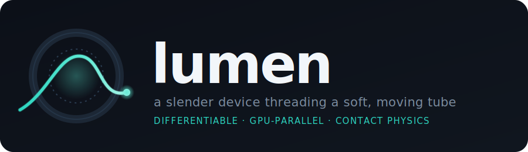
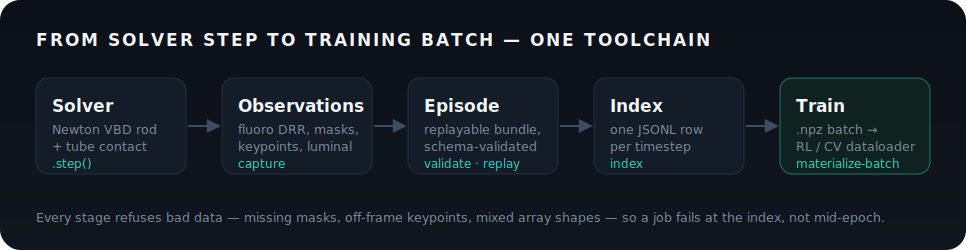
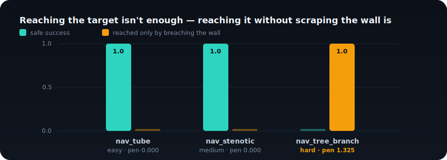

<p align="center">
  
</p>

A guidewire in a vessel, a scope in an airway, an endoscope in a bowel — it's one
physics problem: **a slender device threading a soft, moving tube.** `lumen` solves it
on GPU, with differentiable contact, and stays modality-agnostic. It runs *on* the
[NVIDIA Newton](https://github.com/newton-physics/newton) engine rather than
reimplementing one.

[View on GitHub](https://github.com/SeldingerMed/seldinger-lumen){: .btn }

## Install

```bash
pip install -e ".[dev]"
```

`.[dev]` adds tests, Gymnasium, Warp, and the pinned Newton commit this solver is
validated against; `.[solver]` is the runtime-only subset. Runs on **CPU and CUDA** from
the same code — Warp picks the device at runtime. Set `LUMEN_BACKEND_LOG_LEVEL=info` (or
`debug`) for Warp/Newton diagnostics.

## A 20-second taste

```python
import numpy as np
from lumen.assets import procedural
from lumen.newton.sim import NewtonGuidewireSim

asset = procedural.straight_tube(length=80, radius=2.0)
pts, lumen = asset.edge_arrays(asset.edges[0])
device = np.stack([np.full(11, 1.0), np.zeros(11), np.linspace(4, 24, 11)], axis=1)

sim = NewtonGuidewireSim(pts, R=2.0, device_points=device)
sim.step(insertion=1.0)
```

## From a solver step to a training batch

<p align="center">
  
</p>

```bash
lumen capture           /tmp/lumen-episodes
lumen validate          /tmp/lumen-episodes --require-cv-labels
lumen index             /tmp/lumen-episodes --out /tmp/lumen-episodes/index.jsonl --modality fluoro
lumen inspect-index     /tmp/lumen-episodes/index.jsonl --check-arrays --require-cv-labels
lumen materialize-batch /tmp/lumen-episodes/index.jsonl /tmp/lumen-episodes/batch.npz --limit 32
```

`capture` writes replayable case bundles with previews and CV label overlays. `validate`
gates every bundle's asset, calibration, masks, keypoints, and labels before training;
`--require-cv-labels` makes masks and tip/base keypoints mandatory on every fluoro frame.
`index` writes one JSONL row per timestep; `inspect-index --check-arrays` loads the
referenced arrays and rejects empty masks or off-frame keypoints before a training job
opens anything; `materialize-batch` writes a strict `.npz` batch plus manifest, failing
fast on missing or mixed-shape arrays. See
[EPISODE_SCHEMA.md](https://github.com/SeldingerMed/seldinger-lumen/blob/master/docs/EPISODE_SCHEMA.md)
for the on-disk format.

## The benchmark rewards safe navigation

Reaching the target by scraping the vessel wall is not a solution. The benchmark scores
**safe** reach (no wall-safety breach) separately from raw reach, and ranks safe success
first.

<p align="center">
  
</p>

```bash
lumen benchmark /tmp/lumen-bench
python examples/submit_policy.py /tmp/lumen-bench my-lab-policy
python examples/train_fluoro_nav.py
```

## What it models

- **Tube-intrinsic contact** injected (force + Hessian) into Newton's AVBD solve — implicit and stable.
- **HGO deformable wall** as the shared lumen field `R(s,θ)=R0+w`.
- **Anisotropic, fiber-aligned friction** and **torsion**.
- A finite-extent **clot** (Ogden, progressive damage, stent-retriever capture) and a **1-D flow pressure field**.
- CV-ready observations: contrast/vessel DRR, biplanar fluoro, masks/keypoints, luminal texture, and PNG/AVI previews.
- **Accurate-tier cross-validation** against analytic ground truth.

## Learn more

- [Architecture & design invariants](https://github.com/SeldingerMed/seldinger-lumen/blob/master/ARCHITECTURE.md)
- [Contributing](https://github.com/SeldingerMed/seldinger-lumen/blob/master/CONTRIBUTING.md)

---

Apache-2.0 · clean-room · no CathSim, no patient data (enforced in CI).
