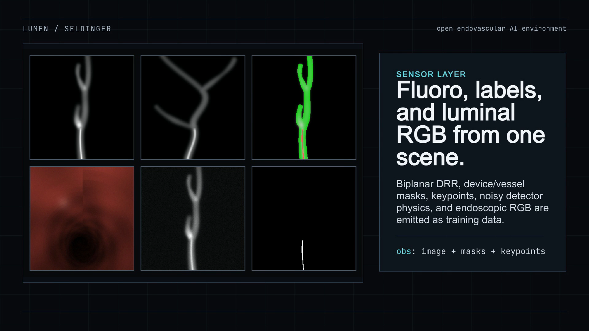
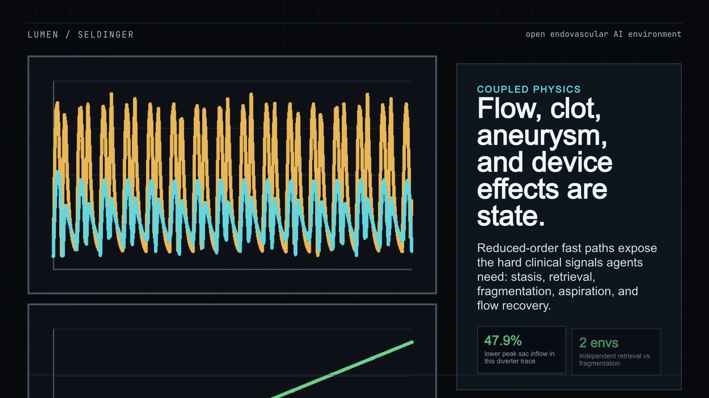
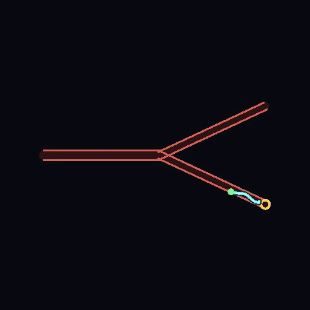
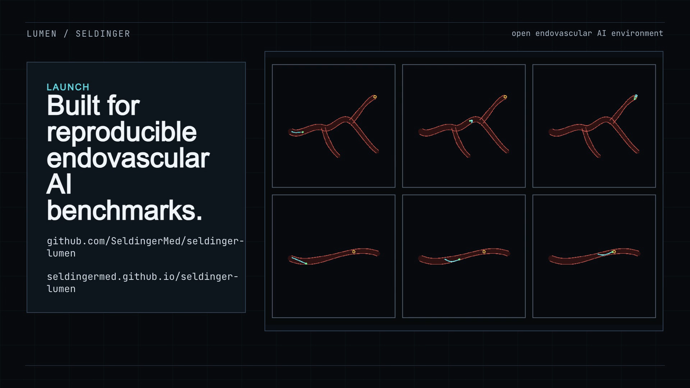

  

    <nav class="lumen-nav" aria-label="Primary">
      <a class="lumen-wordmark" href="https://seldinger.med">Seldinger / Lumen</a>
      

        <a href="https://github.com/SeldingerMed/seldinger-lumen">GitHub</a>
        <a href="assets/launch/lumen-preprint.pdf">Preprint</a>
        <a href="#run">Install</a>
      

    </nav>

    <section class="hero">
      

        
01 Endovascular simulation

        <h1>Target reached. <em>Wall respected.</em></h1>
        
Train catheter and guidewire policies in deformable vascular anatomy. Lumen separates target reach from wall-safe reach, renders matched imaging, and records every episode for replay.

        

          <a class="button primary" href="https://github.com/SeldingerMed/seldinger-lumen">Run Lumen ↗</a>
          <a class="button" href="assets/launch/lumen-preprint.pdf">Read preprint ↓</a>
        

      

      <figure class="hero-media">
        <video src="assets/launch/lumen-launch.mp4" poster="assets/launch/physics-layer.png" controls muted playsinline preload="metadata"></video>
      </figure>
    </section>
  

  <section class="benchmark">
    

      

        
02 Matched benchmark

        <h2>Reach is only half the score.</h2>
      

      

        
In a matched branch-navigation PPO run, both environments trained for 50,000 steps and were evaluated for 30 deterministic held-out episodes. Lumen reached 100% raw success and 100% safe success on <code>nav_tree_branch</code>. CathSim reached 100% raw success on <code>phantom3_bca</code>, but 6.7% safe success under the comparison force threshold.

        

          
<strong>100%</strong>Lumen safe success 30 eval episodes

          
<strong>6.7%</strong>CathSim safe success Matched threshold

          
<strong>6.6×</strong>Evaluation throughput 79.7 vs 12.1 steps/s

        

      

    

  </section>

  

    <section class="content-section" id="systems">
      

        

          
03 System

          <h2 class="section-heading">Shared simulation state.</h2>
        

        
The solver, sensors, observations, and episode record share one state. Change the anatomy, device, or sensor without rebuilding the stack.

      

      <dl class="capability-list">
        
01<dt>Mechanics</dt><dd>Fixed-port guidewire and catheter actuation, deformable walls, finite-radius contact, torsion, friction, flow, clot, retrieval, and flow diversion.</dd>

        
02<dt>Imaging</dt><dd>Fluoroscopy, luminal RGB, masks, keypoints, detector noise, dose, latency, and dropout generated from the same case.</dd>

        
03<dt>Training</dt><dd>Gymnasium environments, vector execution, privileged state, tracked observations, and recurrent raw-image policies.</dd>

        
04<dt>Evidence</dt><dd>Validated episodes, deterministic splits, signed benchmark evidence, replay checks, confidence intervals, and failure taxonomy.</dd>

      </dl>
    </section>

    <section class="content-section">
      

        

          
04 Captures

          <h2 class="section-heading">Simulator output.</h2>
        

        
Every image below comes from the public simulator and ships with the launch package.

      

      

        <figure class="capture"><figcaption>Sensor layerMultimodal</figcaption></figure>
        <figure class="capture"><figcaption>Physics layerState</figcaption></figure>
        <figure class="capture"><figcaption>NavigationPolicy rollout</figcaption></figure>
        <figure class="capture"><figcaption>EvaluationMatched run</figcaption></figure>
      

    </section>

    <section class="content-section" id="run">
      

        

          
05 Run

          <h2 class="section-heading">Install and run.</h2>
        

        <pre class="code-block"><code>git clone https://github.com/SeldingerMed/seldinger-lumen
cd seldinger-lumen
pip install -e ".[dev]"

lumen doctor
lumen play stenotic --out lumen-run
lumen benchmark lumen-bench
lumen capture lumen-episodes</code></pre>
      

    </section>

    <section class="content-section">
      

        

          
06 Research package

          <h2 class="section-heading">Files and results.</h2>
        

        
Read the methods, inspect the benchmark tables, and reproduce the run from the public code.

      

      

        <a class="research-link" href="assets/launch/lumen-preprint.pdf">PaperLumen launch preprintPDF ↓</a>
        <a class="research-link" href="assets/launch/lumen-preprint-latex.zip">SourcePreprint LaTeX packageZIP ↓</a>
        <a class="research-link" href="assets/launch/benchmark/ppo-short-50k-lumen-cathsim-summary.csv">BenchmarkMatched PPO summaryCSV ↓</a>
        <a class="research-link" href="assets/launch/benchmark/pilot-summary-lumen-cathsim-steve.csv">PilotLumen, CathSim, and stEVE summaryCSV ↓</a>
        <a class="research-link" href="https://github.com/SeldingerMed/seldinger-lumen">CodePublic repositoryGitHub ↗</a>
      

    </section>

    <footer class="lumen-footer">
      Apache-2.0 · Seldinger open research
      <a href="https://seldinger.med">Seldinger.med ↗</a>
    </footer>
  

